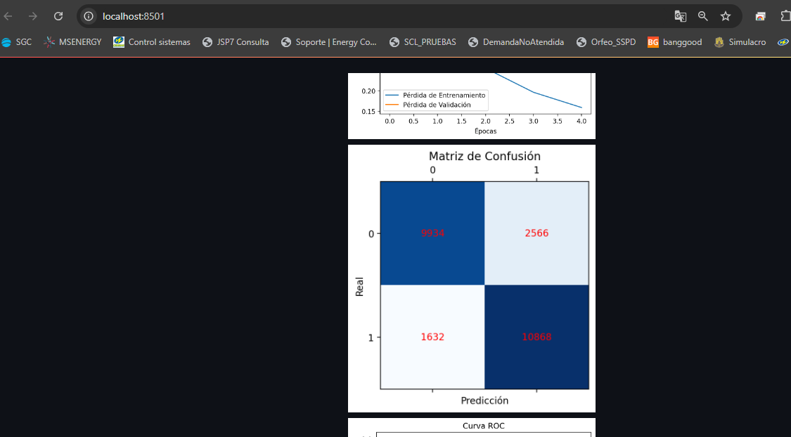

# IMDB Streamlit App

# Presentado por: Luis Eduardo Solarte R. Alejandro Valencia. Diego Alejandro Rodriguez.

## Descripción

Este proyecto es una aplicación web desarrollada en Python utilizando Streamlit que permite cargar, entrenar y evaluar un modelo de aprendizaje profundo utilizando el dataset de reseñas de IMDB. La aplicación incluye visualizaciones de métricas de entrenamiento, matriz de confusión, y la curva ROC, todo desde una interfaz interactiva y fácil de usar.

## Características

- **Carga y preprocesamiento de datos:** El dataset de reseñas de IMDB se carga y se preprocesa automáticamente.
- **Entrenamiento de modelos:** La aplicación permite entrenar un modelo de clasificación de texto utilizando TensorFlow.
- **Visualización de métricas:** Se generan gráficos de la función de pérdida, matriz de confusión, y curva ROC.
- **Interfaz de usuario interactiva:** La aplicación está construida con Streamlit, lo que permite una interacción dinámica y visualización en tiempo real.

## Requisitos

- Python 3.7 o superior
- TensorFlow 2.x
- Streamlit
- TensorFlow Datasets
- Scikit-learn
- Matplotlib

## Descripción

1. 
  Al ejecurar el contenedor localmente se debe abrir el navegador y digitar la siguiente direccion web 'http://localhost:8501/' donde
  se abrira la descripcion del data set.
  
2. Para ejecutar la aplicacion se debe dar click en 'Entrenar Modelo' en el botón al final de la descripcion
  
3. La aplicacion ira mostrando la información de cada epoca de entrenamiento y las metricas resultantes.
  
4. Al final del entrenamiento el usuario visualizará las graficará la función de costo, la matriz de confusión y la curva Roc resultante 
   del fin del entrenamiento.

## Función de Costo
 

## Matriz de Confusión
 

## Matriz de Confusión
 

5. **Clonar el repositorio:**
   A. 1. Crear un archivo Dockerfile
          Primero, crea un archivo llamado Dockerfile en el mismo directorio donde tienes tu aplicación app.py. Este archivo describirá cómo se 
          debe construir la imagen Docker.
                          # Use the official Python image as a base image
                          FROM python:3.11-slim
                          
                          # Set the working directory in the container
                          WORKDIR /app
                          
                          # Copy the current directory contents into the container at /app
                          COPY . /app
                          
                          # Install any needed packages specified in requirements.txt
                          RUN pip install --no-cache-dir -r requirements.txt
                          
                          # Expose the port that Streamlit uses
                          EXPOSE 8501
                          
                          # Run streamlit when the container launches
                          CMD ["streamlit", "run", "app.py", "--server.port=8501", "--server.address=0.0.0.0"]

   git clone https://github.com/lukeds14/imdb-streamlit-app.git
   cd imdb-streamlit-app
