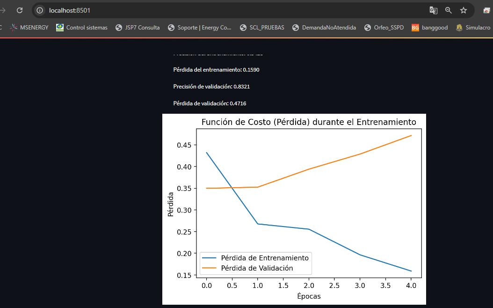

# IMDB Streamlit App

 ## Presentado por: Alejandro Valencia. --  Diego Alejandro Rodriguez.  --   Luis Eduardo Solarte R. 
## Descripción

Este proyecto es una aplicación web desarrollada en Python utilizando Streamlit que permite cargar, entrenar y evaluar un modelo de aprendizaje profundo utilizando el dataset de reseñas de IMDB. La aplicación incluye visualizaciones de métricas de entrenamiento, matriz de confusión, y la curva ROC, todo desde una interfaz interactiva y fácil de usar.

Para la misma aplicación se desarrolla una interfaz grafica con tkinter, en el apartado ' Descripcion Aplicacion con Tkinter' se explica
como ejecutar la aplicacion localmente, la aplicacion funciona igual que en la descripción pero en la interfaz descrita.

## Características

- **Carga y preprocesamiento de datos:** El dataset de reseñas de IMDB se carga y se preprocesa automáticamente.
- **Entrenamiento de modelos:** La aplicación permite entrenar un modelo de clasificación de texto utilizando TensorFlow.
- **Visualización de métricas:** Se generan gráficos de la función de pérdida, matriz de confusión, y curva ROC.
- **Interfaz de usuario interactiva:** La aplicación está construida con Streamlit, lo que permite una interacción dinámica y visualización en tiempo real.

## Requisitos

- Python 3.7 o superior
- TensorFlow 2.x
- Streamlit
- TensorFlow Datasets
- Scikit-learn
- Matplotlib

## Descripción Aplicación con Streamlit montada un contenedor Docker.

1. Al ejecurar el contenedor localmente se debe abrir el navegador y digitar la siguiente direccion web 'http://localhost:8501/' donde
  se abrira la descripcion del data set.
  
2. Para ejecutar la aplicacion se debe dar click en 'Entrenar Modelo' en el botón al final de la descripcion
  
3. La aplicacion ira mostrando la información de cada epoca de entrenamiento y las metricas resultantes.
  
4. Al final del entrenamiento el usuario visualizará las graficará la función de costo, la matriz de confusión 
   y la curva Roc resultante del fin del entrenamiento.

## Función de Costo
 

## Matriz de Confusión
 

## Curva ROC
 

5. **Clonar el repositorio:**
    ## A. Crear un archivo Dockerfile
          Primero, crea un archivo llamado Dockerfile en el mismo directorio donde tienes tu aplicación app.py. Este archivo describirá cómo se 
          debe construir la imagen Docker.

                              # Use the official Python image as a base image
                              FROM python:3.11-slim
                              
                              # Set the working directory in the container
                              WORKDIR /app
                              
                              # Copy the current directory contents into the container at /app
                              COPY . /app
                              
                              # Install any needed packages specified in requirements.txt
                              RUN pip install --no-cache-dir -r requirements.txt
                              
                              # Expose the port that Streamlit uses
                              EXPOSE 8501
                              
                              # Run streamlit when the container launches
                              CMD ["streamlit", "run", "app.py", "--server.port=8501", "--server.address=0.0.0.0"]

  ## B. Crear un archivo requirements.txt
        Crea un archivo llamado requirements.txt en el mismo directorio para especificar las dependencias de Python
                            streamlit==1.25.0
                            tensorflow==2.15.0
                            matplotlib==3.8.0
                            scikit-learn==1.3.0
                            numpy==1.26.3
                            tensorflow-datasets==4.9.6

   ## C. Construir la imagen Docker
         Navega al directorio donde se encuentra el Dockerfile y ejecuta el siguiente comando para construir la imagen Docker:

                             docker build -t imdb-streamlit-app .

   ## D. Ejecutar el contenedor Docker
           Una vez que la imagen Docker se ha construido, puedes ejecutar un contenedor basado en esa imagen usando el siguiente comando:

                             docker run -p 8501:8501 imdb-streamlit-app

   Este comando hará que tu aplicación esté disponible en http://localhost:8501 en tu navegador.                     
    
   ## E. Verificar la Aplicación
           Abre tu navegador web y visita http://localhost:8501 para ver tu aplicación en funcionamiento.

Otros usuarios ahora pueden ejecutar tu aplicación directamente desde Docker Hub usando:
   docker run -p 8501:8501 lukeds14/imdb-streamlit-app

#  Descripcion Aplicacion IMDB con Tkinter

Para la ejecucion de la aplicación con la interfaz de Tkinter se debe crear el directorio 'streamModel' y copiar los siguientes archivos:

             - dataset.py
             - model.py
             - interfaz.py
## Se debe instalar las librerias necesarias descritas en el archivo requirements.txt

             - streamlit==1.25.0
             - tensorflow==2.15.0
             - matplotlib==3.8.0
             - scikit-learn==1.3.0
             - numpy==1.26.3
             - tensorflow-datasets==4.9.6

## Para ejecutar el proyecto se debe ubicar en el directorio streamModel con el siguiente comando:

             - cd streamModel
   Una vez ubicados en el directorio desde el bash (cmd) ejecutamos:

             - python interfaz.py

   Si no muestra mensaje de error se abrira una ventana de la interfaz de Tkinter de la siguiente manera:

    

## Para ejecutar la aplicación hacemos click en el Boton 'Entrenar Modelo' y al terminar presenta las metricas de entrenamiento y los resultados de cada epoca.

   

## Una vez terminado se muestran las graficas de funsión de costo, matriz de confusión y la curva ROC.

   

## Matriz de confusión

   

## Curva ROC

   

  
